# Documentação sobre como usar o sistema

## Interface de linha de comando

Ao correr a aplicação irá listar o menu
```
(H) Help
(1) Publicação
(2) Análise
(3) Listar Autores 
(4) Import  
(0) Sair
```

## Help
Ao inserir esta opção aparecerá uma listagem dos menus e opções presentes na aplicação. 
```
----------- HELP -----------
(1) Publicação
    (1.1) Criar uma Publicação
    (1.2) Consultar uma Publicação através de ID
    (1.3) Consultar Publicações (Título, Autor, Afiliação, Palavra-Chave, Data de Publicação)
    (1.4) Eliminar uma Publicação através de ID
(2) Análise
    (2.1) Frequência Keywords
    (2.2) Palavras do Ano
    (2.3) Publicações por Autor
    (2.4) Quantidade de Publicações de Autor por Ano
    (2.5) Publicações por Ano
    (2.6) Publicações por mês
(3) Listar todos os autores e todas as publicações por cada autor
(4) Importar Publicações, carregar base de dadoss
```
## 1. Publicações
Ao inserir esta opção. Irão aparecer as opções para Criar, Consultar ID, Consultar por filtros, Eliminar e Volta.
```
(1) Criar
(2) Consultar ID
(3) Consultar por filtros 
(4) Eliminar
(0) Voltar
```

### 1. 1. **Criar**  
  Para criar uma nova publicação:
  1. Complete as informações da publicação, como resumo, palavras-chave, autores, DOI, etc. O programa irá criar a publicação e adicioná-la à base de dados.

### 1. 2. Consulta
  
  Para consultar uma publicação pelo ID (últimos números do DOI):
  1: Insira o DOI da publicação que deseja consultar. O programa mostrará todos os detalhes da publicação.

### 1. 3. Filtragens
 Ao inserir a opção de filtragem poderá filtrar as publicações por título, autor, afiliação, palavra-chave ou data. O programa depois irá mostrar o titulo, ID e data das publicações filtradas. Os IDs podem depois ser usados na opção de consulta caso queira ver os detalhes das publicações.
 ```
 ----- Filtros -----
(1) Título
(2) Autor
(3) Afiliação 
(4) Palavra-Chave
(5) Data de Publicação 
(0) Voltar
 ```
#### 1. 3. 1. **Título**  
  Para consultar todas as publicações que contêm um título específico:
  1. Insira o título da publicação que deseja encontrar. Este título não é necessário ser igual mas pode ser apenas uma parte do título original. Exemplo: Inserir "Hospital" irá retornar todas as publicações com hospital no título.

#### 1. 3. 2. **Autor**   
  Para consultar todas as publicações de um autor:

  1.Insira o nome do autor que você quer pesquisar.

#### 1. 3. 3. **Afiliação**
  Para consultar todas as publicações que tenhem a afiliação inserida:
  1. Insira a afiliação.

#### 1. 3. 4. **Palavra-Chave**  
  Para consultar todas as publicações que contêm uma palavra-chave específica:
  
  1.Insira a palavra-chave que deseja encontrar. 
  Retorna todas as publicações que contêm a palavra-chave fornecida.

#### 1. 3. 5.**Data de Publicação**  
  Para consultar todas as publicações publicadas numa data específica:
  1.Insira o data da publicação que deseja pesquisar. Retorna todas as publicações com essa data.
#### 1. 3. 6. **Voltar**
  Regressa ao menu interior  

### 1. 4. Eliminar 
  
  Para eliminar uma publicação pelo ID:
  **Passo 1**: Insira o ID da publicação que deseja eliminar.

### 1. 0. Voltar
  Esta opção permite voltar ao menu inicial.

## 2. Análise

Esta opção permite-lhe criar gráficos de estatísticas do *dataset*:
```
(1) Frequência Keywords
(2) Palavras do Ano
(3) Publicações por Autor
(4) Quantidade de Publicações de Autor por Ano
(5) Publicações por Ano
(6) Publicações por mês
(0) Voltar
```
### 2. 1. **Frequência Keywords**  
  Para obter as `n` palavras-chave mais frequentes:

  **Passo 1**: Insira o número de palavras-chave que deseja listar (por exemplo, 10 para as 10 mais frequentes).
  Retorna as 10 palavras-chave mais frequentes nas publicações.

### 2. 2. **Palavra por ano**  

  Para obter as `n` palavras-chave mais frequentes de um ano específico:

  **Passo 1**: Insira o número de palavras-chave que deseja listar

  **Passo 2**: Insira o ano.

### 2. 3. **Publicações por Autor**

  Retorna o gráfico dos `n` autores com mais publicações:

  **Passo 1**: Insira o número de autores que deseja.

### 2. 4. **Quantidade de Publicações de Autor por Ano** 

  Para obter o número de publicações de um autor organizadas por ano.

  **Passo 1**: Insira o nome do autor

### 2. 5.  **Publicações por Ano**

  Retorna um gráfico do número de publicações organizadas por ano.

### 2. 6.  **Publicações por mês**  

  Para obter o gráfico de publicações por mês de um ano específico:

  **Passo 1**: Insira o ano desejado.
  Retorna o gráfico com a distribuição de publicações por mês no ano inserido.

### 2. 0. Voltar
  Esta opção permite voltar ao menu inicial.

## 3. **Listar todos os autores e todas as publicações por cada autor**  
  Para listar todos os autores da base de dados, ordenados alfabeticamente, bem como as respetivas publicações. Tal como nos filtros, só aparece o título, data e ID das publicações.
  Os autores aparecem paginados 5 a 5. Para passar à próxima página insira "P", caso queira sair insira "S".

## 4. **Importar**
  Para importar um ficheiro e adicionar as publicações presentes nesse ficheiro à base de dados:

  **Passo 1**: Insira o nome ou caminho do ficheiro.

## 0. **Sair**
  Esta opção fecha a aplicação e guarda todas as alterações feitas no ficheiro original.

## Interface gráfica

### Introdução
Esta documentação detalha o funcionamento da aplicação desenvolvida com o PySimpleGUI, explicando cada componente da interface, as suas funcionalidades e como os utilizadores podem interagir com ela. A aplicação é composta por módulos de pesquisa, gestão, filtros e relatórios gráficos.


### Estrutura da Interface


Quando a aplicação é iniciada, a base de dados é carregada, pelo que aparece o titulo de todas as publicações da base de dados.

### Pesquisa e Filtros
#### 1. **Inserir título:** No campo "Título", digite o título da publicação desejada. À medida que escreve, a *listbox* vai se atualizando permitindo uma resposta mais fluída e eficiente.

#### 2. **Aplicar filtros:** Clique em "Filtros" para expandir as opções de filtragem.


   - **Afiliação**: Este filtro permite filtrar as publicações de acordo com a afiliação inserida. Este filtro também vai atualizando a *listbox* aquando à inserção do texto.

   - **Autor**: A filtragem por autor abre uma janela com a lista todos os autores da base de dados, na qual existe também uma barra de pesquisa possibilitando a pesquisa dos autores por texto. Nesta janela também esta incluído um botão que permite ordenar os autores por ordem alfabética ou pela frequência pela qual aparecem na base de dados.

      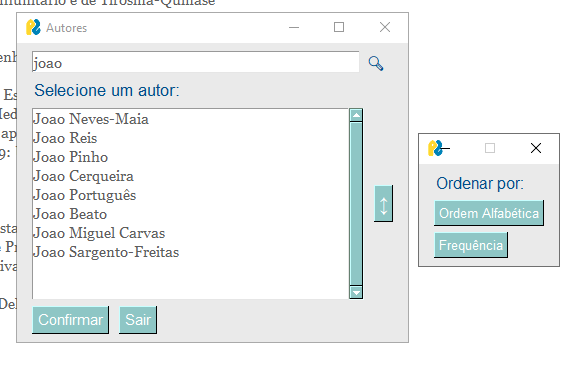

   - **Ano, Mês e Dia**: Cada um destes parâmetros apresenta uma *combobox*. Assim é possível filtrar a pesquisa por ano, por mês ou por dia, podendo estar combinados formando uma data específica.

      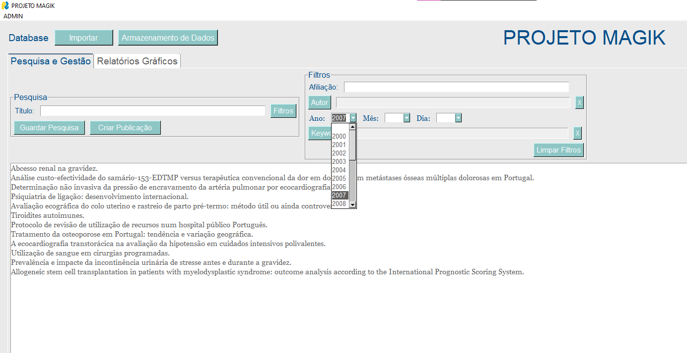

   - **Keyword**: Assim como o filtro por autores, este também abre uma janela com a lista das palavras-chave presentes na base de dados pelo que é possível pesquisá-las usando a barra de pesquisa. Mais uma vez, está presente um botão que permite ordenar as palavras chave por ordem alfabética e ocorrência, para além disso, como é possível selecionar mais do que uma palavra elas vão aparecendo no fundo da janela.

      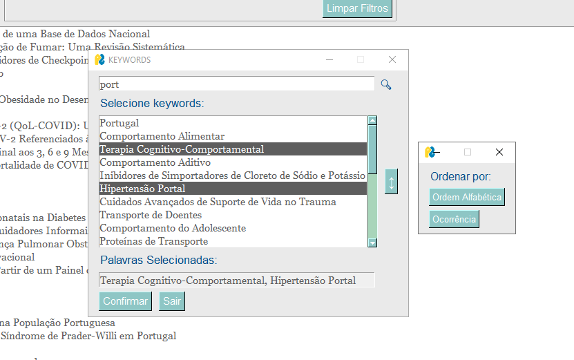

   - **Limpar Filtros**: Este botão permite limpar todos os filtros selecionados, returnando a *listbox* com as publicações ao seu estado original.

Os filtros podem ser usados em simultâneo e é possível eliminar o autor selecionado ou as palavras-chave selecionadas clicando no botão "X".

#### 3. **Guardar Pesquisa**: Esta opção abre uma janela que permite definir o nome do ficheiro (extensão .json) e a pasta onde a pesquisa realizada vai ser guardada.


#### 4. **Detalhes da publicação**: Quando clica no título de uma das publicações, aparecem os detalhes sobre essa publicação, assim como um botão para a atualizar que falaremos mais à frente.

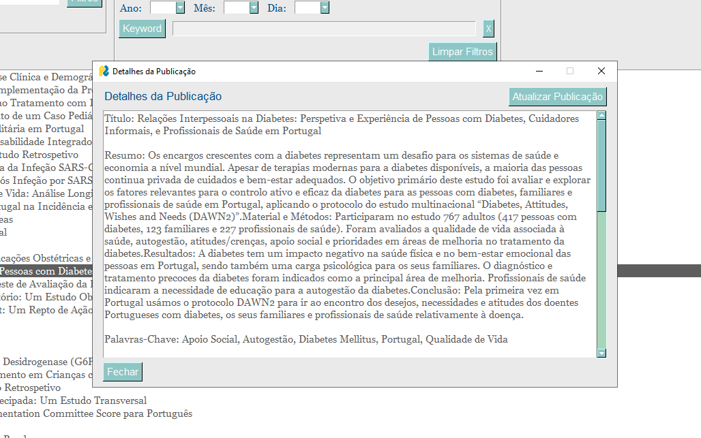

### Gestão de Dados

#### 1. **Criar Publicação**: Este botão abre uma janela com os campos possíveis para criar uma nova publicação, pelo que alguns deles são obrigatórios.

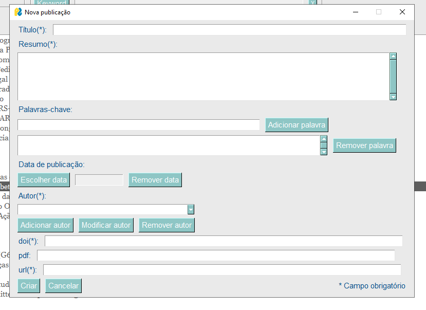

   - **Título**: Neste campo é possivel introduzir o título da publicação.
   - **Resumo**: Neste campo é introduzido o resumo do conteúdo da publicação.
   - **Palavras-chave**: Aqui é possivel introduzir as palavras-chave desejadas, estas serão introduzidas na caixa de texto abaixo pelo que poderão ser removidas clicando no botão "Remover Palavra".

      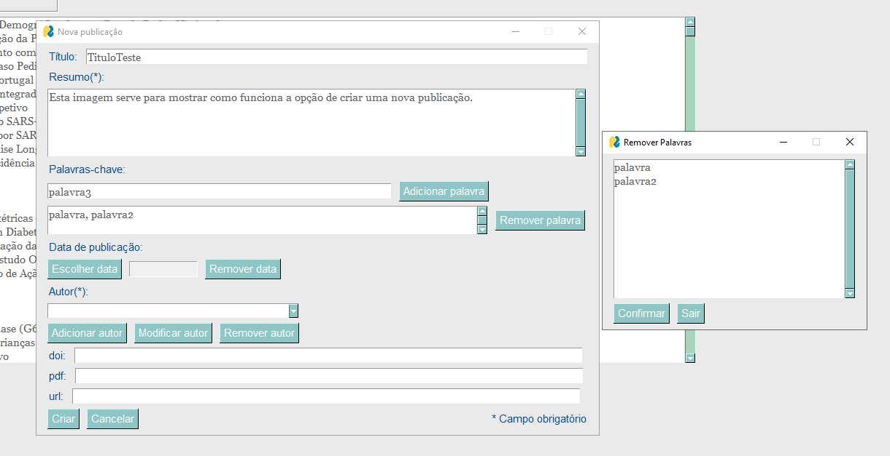

   - **Data**: Ao clicar no "Escolher data" abre uma janela onde é possível escolher uma data, a partir de um calendário. O botão "Remover data" permite remover a data selecionada.
      
   - **Autores**: Para gerir os autores da nova publicação existem 3 opções: "Adicionar autor", "Modificar Autor" e "Remover autor". Para além disso existe 
uma *combobox* com o nome dos autores adicionados.
     - **Adicionar autor**: Esta opção abre uma janela para preencher as informações sobre o autor.

        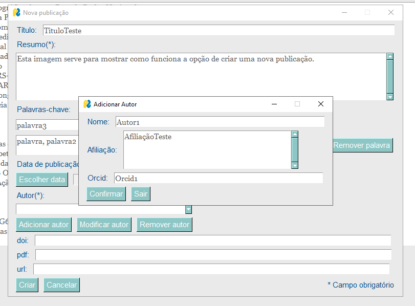

     - **ModificarAutor**: Com este botão é possível modificar um autor previamente adicionado.

        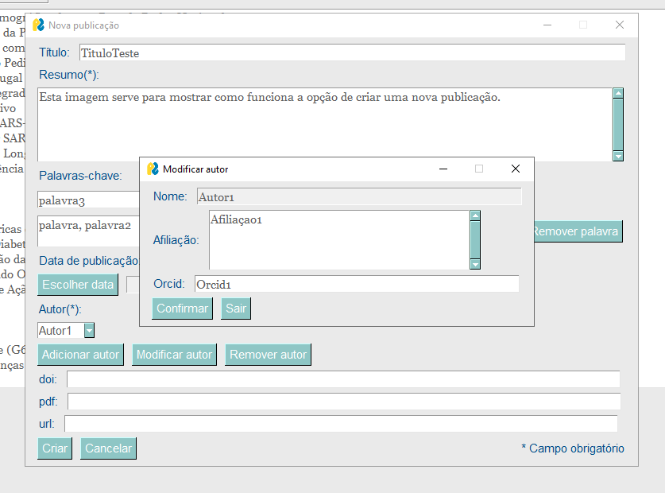

     - **Remover autor**: Permite remover um autor selecionado no combo.
   - **Doi**: Neste campo é introduzido o doi da publicação.
   - **Pdf**: Neste campo é introduzido o pdf da publicação.
   - **Url**: Neste campo é introduzido o url da publicação.

#### 2. **Atualizar Publicação**: Esta opção está presente quando clicamos numa publicação como foi referido e mostrado anteriormente. Abre-se, então, uma janela com a informação da publicação.
   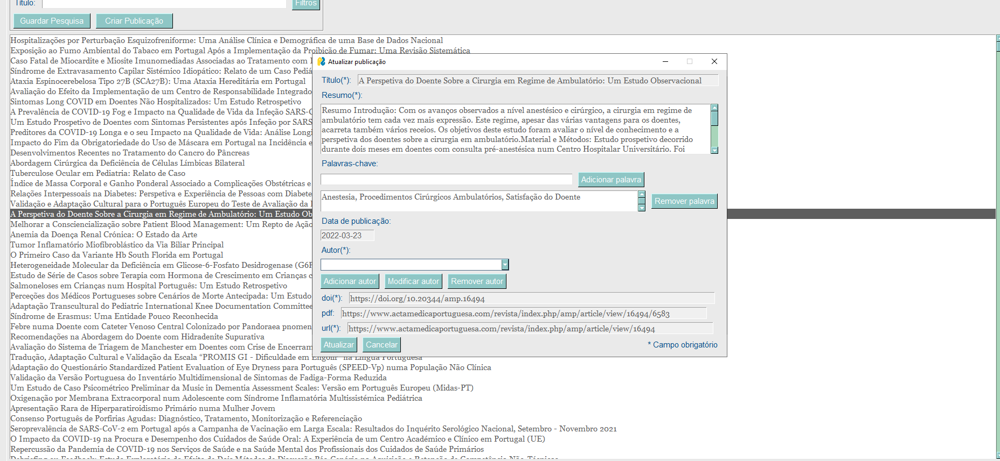

   - **Título**: Aqui está presente o título da publicação que não pode ser alterado
   - **Resumo**: Neste campo é possível alterar o resumo da publicação.
   - **Palavras-chave**: Na multiline estão presentes as palavra-chave separadas por vírgula. Pelo que é possível usar o primeiro campo para adicionar novas palavras, assim como remover as palavras desejadas, como já foi explicado anteriormente.

      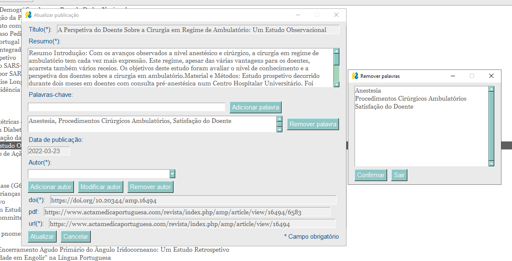

   - **Data**: Este campo mostra a data de quando a publicação foi publicada, pelo que se esta for atualizada na estrutura da base de dados, a data será seguida pela data de quando foi atualizada.

   - **Autores**: Para gerir os autores da publicação existem 3 opções: "Adicionar autor", "Modificar Autor" e "Remover autor". Para além disso existe um combo com o nome dos autores.
     - **Adicionar autor**: Esta opção abre uma janela para preencher as informações sobre o autor, como já foi mostrado anteriormente

     - **ModificarAutor**: Com este botão é possível modificar um autor previamente adicionado.

        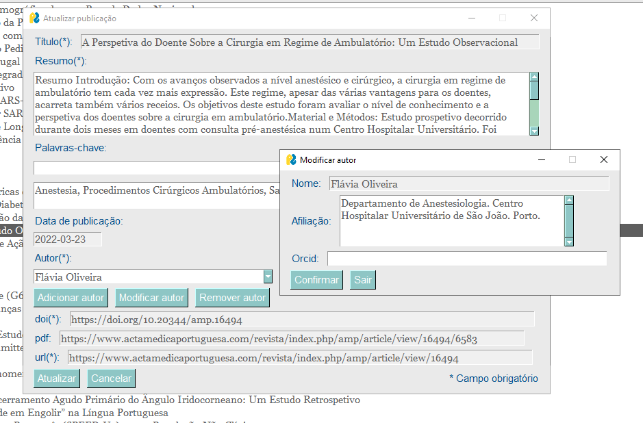

     - **Remover autor**: Permite remover um autor selecionado na *combobox*.

   - **Doi**: Neste campo é mostrado o doi da publicação.
   - **Pdf**: Neste campo é mostrado o pdf da publicação.
   - **Url**: Neste campo é mostrado o url da publicação.

#### 3. **Importar**: Este botão abre uma janela que permite pesquisar um ficheiro .json nos ficheiros do utilizador e extrai a informação para a base de dados, se for nova.

   

#### 4. **Armazenamento de Dados**: Com esta opção é possível guardar todas as alterações feitas à base de dados, quer por uso das funções de criar ou atualizar, quer por importação de dados.

### Relatórios Gráficos

1. **Publicações por ano**: Ilustra um gráfico com a distribuição das publicações por anos.

2. **Publicações por mês de um determinado ano**: Abre uma janela com os anos existentes na base de dados. Após a seleção de um ano, mostra um gráfico com a distribuição das publicações pelos meses desse ano.

   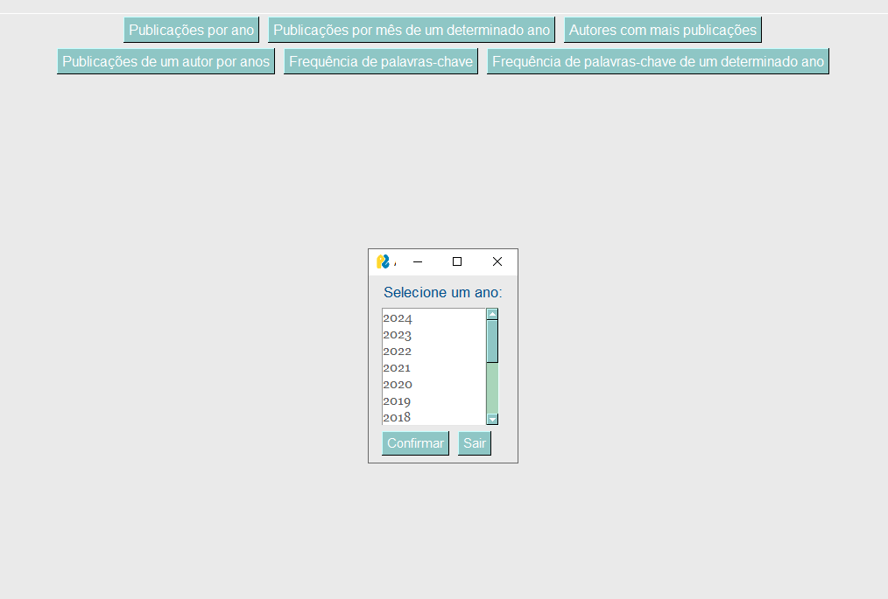

3. **Autores com mais publicações**: Mostra um gráfico com os 20 autores com mais publicações, assim como o número de publicações de cada um.

4. **Publicações de um autor por anos**: Abre uma janela semelhante ao filtro por autores, na qual é possível pesquisar um autor. Para o autor selecionado, aparecerá um gráfico com a distribuição das publicações desse autor por anos.

5. **Frequência de palavras-chave**: Ilustra um gráfico com as 20 palavras-chave mais frequentes na base de dados, assim como a quantidade de vezes que aparecem.

6. **Frequência de palavras-chave de um determinado ano**: Abre uma janela com vários anos, semelhante àquela aberta para o gráfico das publicações por mês. Para cada ano selecionado é mostrado um gráfico com a frequência das palavras-chave mais frequentes desse ano.


## Interface de administrador
#### **1. Introdução**
A página de Admin foi desenvolvida para auxiliar o desenvolvedor a ter acesso a ferramentas importantes, sem ter necessidade de utilizar a linha de comando. Esta oferece funcionalidades iguais às que estão presentes na interface de comando, permitindo desde a criação e consulta até à realização de análises mais detalhadas.

#### **2. Funcionalidades Principais**

##### **2.1. Gestão de Publicações**

**a) Criar uma Nova Publicação**
- Esta funcionalidade permite adicionar uma nova publicação à base de dados.
- O Admin deve preencher os campos obrigatórios: título, resumo e autores, para além dos obigatórios possibilita o usuário inserir informações tais como DOI, palavras-chave, data de publicação e link para o PDF. Que semelhante à funcionalidade criar na janela de usuário esta premite ao admin criar uma publicação sem ter de retroceder para a página principal.

**b) Consultar Publicações**
  - **Por ID:** Utiliza um ID para consulta de uma determinada publicação. Esta funcionalidade também permite a eliminação de uma publicação.
  - **Por Filtro:** Permite procurar por publicações com critérios tais como título, autor, afiliação, palavras-chave ou data.

##### **2.2. Análise de Publicações**
  - **Top palavras-chave:** Que baseando-se num número apresentado pelo admin, exibe o top número de palavras-chave utilizadas.
  - **Palavras por ano:** Que apresenta a quantidade de palavras nas publicações para x ano inserido pelo admin.
  - **Publicações por autor:** Que baseando-se num número apresentado peo admin, exibe o top números de publicações por autor.
  - **Publicações de autor por ano:** Que através de uma janela de seleção do autor, apresenta o número de publicações por ano do autor selecionado pelo admin.
  - **Publicações por Ano/Mês:** Mostra a distribuição das publicações por ano ou por mês, sendo este último necessária a seleção do ano por parte do admin.

##### **2.3. Listar autores**
- Lista todos os autores registados e exibe as publicações associadas a cada um.

##### **2.4. Gestão**
- **Importar:** Carrega dados de um arquivo JSON externo, verificando se o ficheiro é compatível.
- **Guardar:** Guarda o ficheiro num ficheiro previamente importado, ou cria um novo ficheiro caso não haja ficheiro no sistema.


