# Exemplos de execução do sistema;
##  **1. Exemplos de execução da interface de linha de comando**

### **Consulta e pesquisa**
Exemplo de consulta de uma publicação:

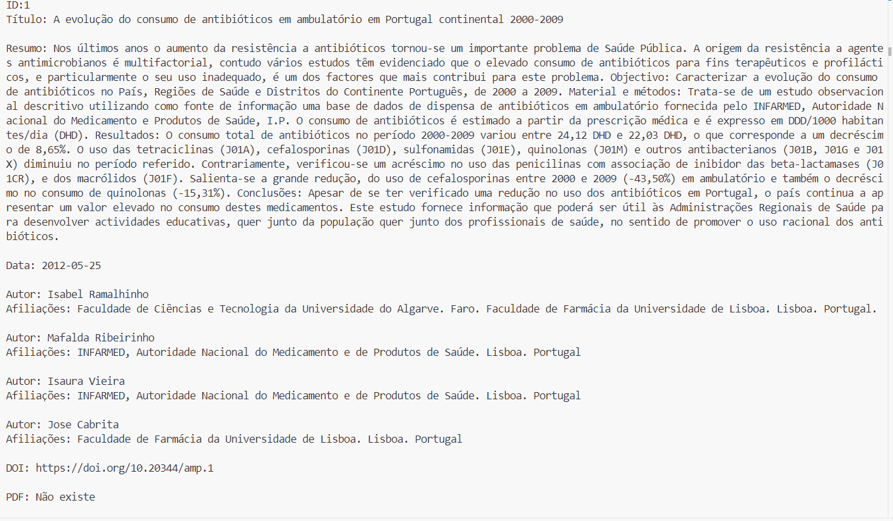

Exemplo de pesquisa de publicações que tenham "Hospitalização" no título:

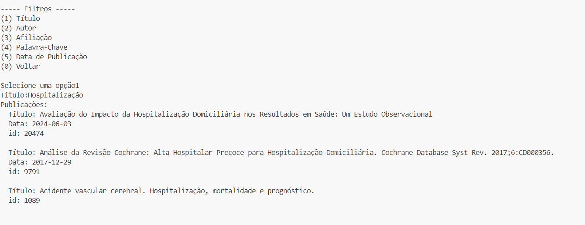

Exemplo de pesquisa de publicações do autor "António Vaz Carneiro":

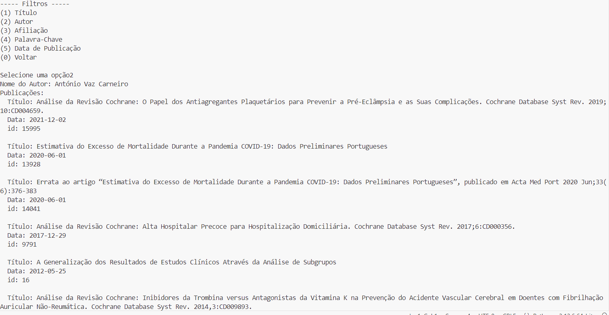

### **Estatísticas e gráficos**
Exemplo do gráfico que mostra o número de publicações por ano:

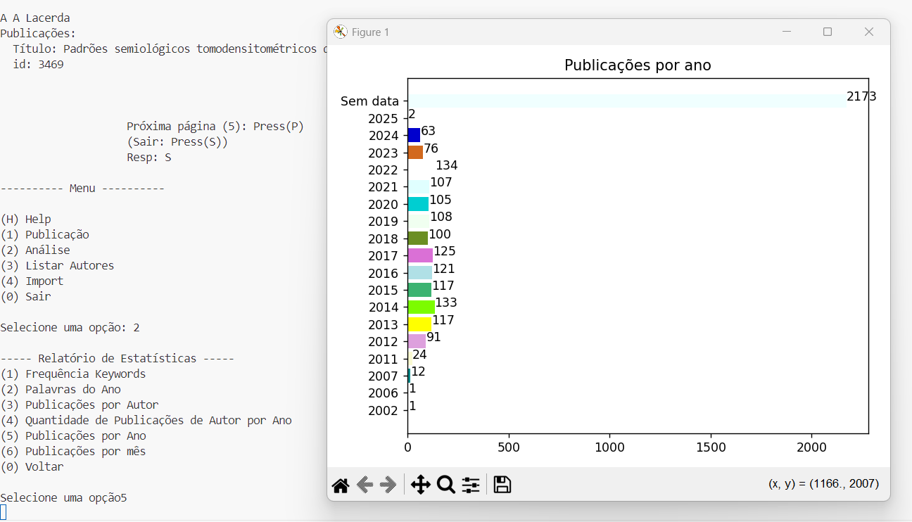

### **Listar autores e as suas publicações**
Exemplo da listagem de autores e das respetivas publicações:

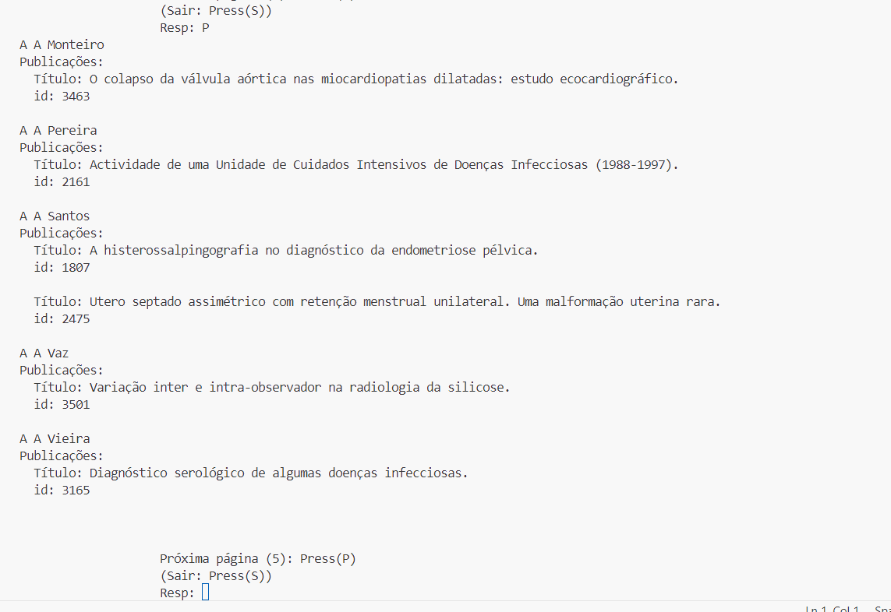
###
##  **2. Exemplos de execução da interface gráfica**

### **Pesquisa e consulta**
Exemplo de uma pesquisa de publicações contendo "Análise" no título, do autor "João Costa, publicadas em 2017:

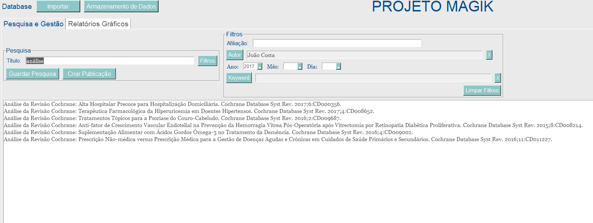

Exemplo da consulta de uma das publicações anteriores:

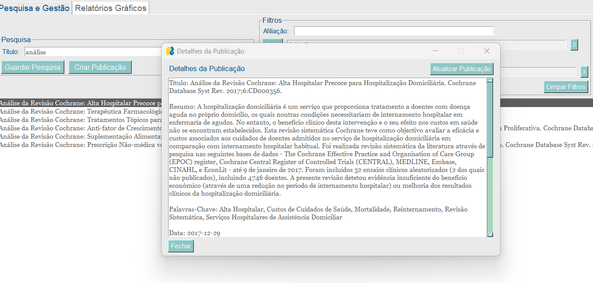

### **Importar e exportar**

Exemplo da importação um ficheiro:

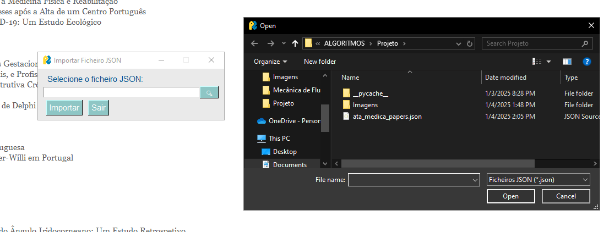

Exemplo de exportar uma pesquisa:

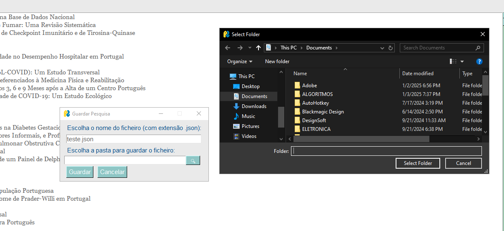

### **Gráficos**:

Exemplo do gráfico que mostra o Top 20 de autores com mais publicações:

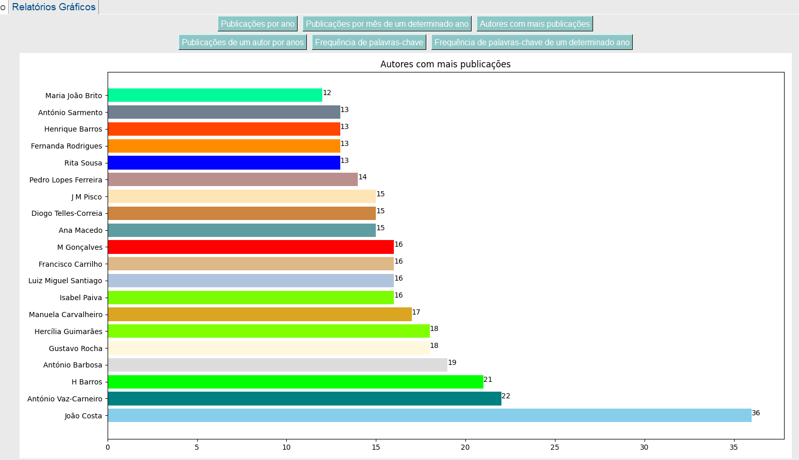

Exemplo do gráfico que mostra as palavras-chaves mais utilizadas no ano de 2018:

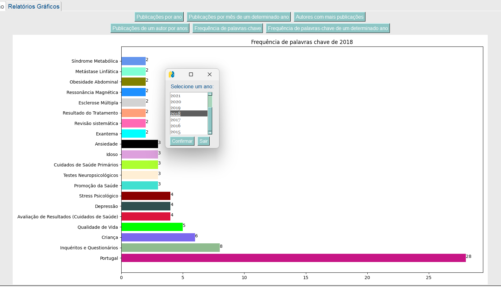

## **3. Exemplos de execução da interface ADMIN**

### **3.1. Criar uma Nova Publicação**
1. Aceda a "Publicações" e selecione "Criar Publicação" depois de iniciar sessão na sua conta Admin
2. Preencha os campos obrigatórios:
   - **Título:** "Avaliação do Efeito da Implementação de um Centro de Responsabilidade Integrado de Obesidade no Desempenho Hospitalar em Portugal."
   - **Resumo:** "Resumo O aumento contínuo na prevalência da obesidade é um desafio ao nível global, em termos económicos e de saúde pública. Em Portugal, o tratamento (...) para o acesso a tratamentos especializados, retenção de profissionais e sustentabilidade financeira."
   - **Autores:** "Jorge Carvalho, Adalberto Campos Fernandes"
3. Adicione informações opcionais, como:
   - **Palavras-chave:** "Acesso aos Serviços de Saúde, Avaliação de Resultados em Cuidados de Saúde, Departamentos Hospitalares/organização e administração, Governança Clínica, Obesidade, Portugal"
   - **Data de Publicação:** "2024-08-30"
4. Clique em "Criar"

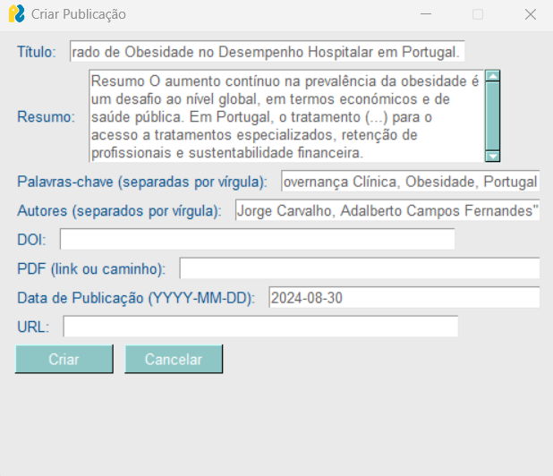
### **3.2. Consultar Publicação por Filtro**
1. Aceda a "Publicações" e selecione "Consultar Filtro"
2. Escolha o critério de procura, por exemplo, "Autor"
3. Insira o nome do autor no campo fornecido, como "Ana Silva"
4. O programa exibirá todas as publicações desse autor

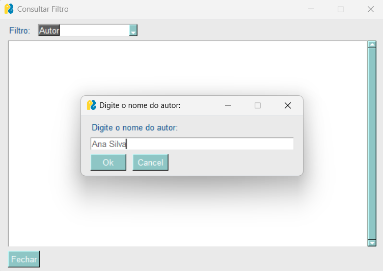
### **3.3. Realizar Análise de Publicações**
1. Aceda a "Análise" e selecione "Top palavras-chave"
2. Insira o número desejado, por exemplo, "5"
3. O programa exibirá as 5 palavras-chave mais utilizadas, junto com sua frequência
  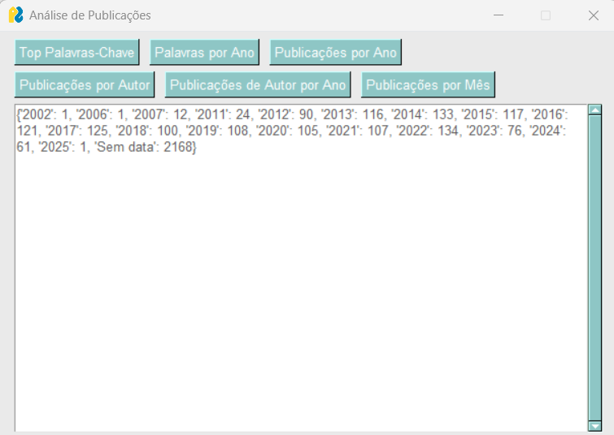
### **3.4. Guardar a Base de Dados**
1. Selecione "Guardar"
2. O programa gravará automaticamente as alterações feitas num ficheiro importado juntamente com uma mensagem de resolução. Caso não se encontre nenhum ficheiro importado no ficheiro terá de inserir o nome do novo ficheiro que será criado

     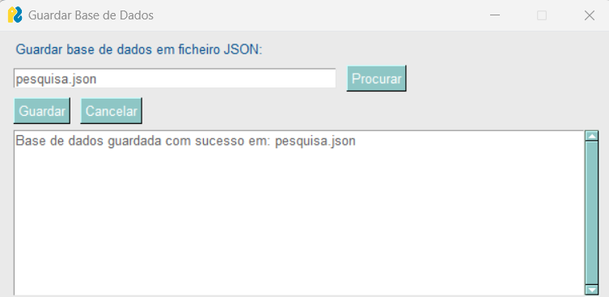
